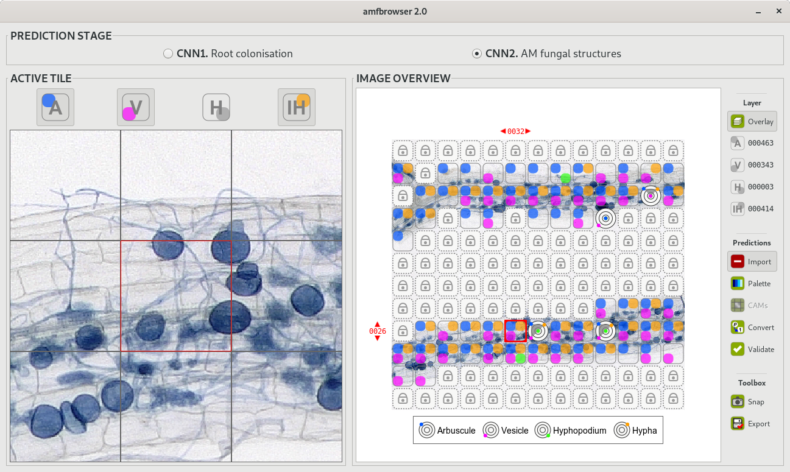

# AMFinder

The Automatic Mycorrhiza Finder (AMFinder) allows for automatic computer
vision-based identification and quantification of AM fungal colonisation
and intraradical hyphal structures on ink-stained root images using
convolutional neural networks.

**The latest version of AMFinder is v2.0.**

## Summary

1. [Command-line tool `amf`](#amf)
2. [Standalone interface `amfbrowser`](#amfbrowser)

## Command-line tool `amf`<a name="amf"></a>

**The command-line tool `amf` Train neural networks and predict fungal colonisation and intraradical structures.**

### Installation instructions

**Manual installation**

1. Install **Python 3.7** from the [official website](https://www.python.org/) or from your package manager.

2. Open a terminal and install the package `virtualenv` by running the command: `python -m pip install virtualenv` (replace `python` with the name of the Python program on your system).
3. Create a virtual environment. In a terminal, run: `python -m venv amfenv`.
4. Activate the virtual environment. In a terminal, run: `source amfenv/bin/activate`.
5. Donwload AMFinder sources from Github and extract the archive. Move to the `amf` folder. For instance, run in a terminal: `cd amf`.
6. Upgrade the Python installer `pip`. In a terminal, run: `python -m pip install --upgrade pip`.
7. Install the required Python libraries listed in file `requirements.txt`. In a terminal, run : `python -m pip install -r requirements.txt`.
8. The command-line tool is now ready to use (see next section). After use, deactivate the virtual environment (in a terminal, run: `deactivate`). You will need to reactivate the virtual environment for future use (step 4 above).

**Semi-automatic installation**

The commands listed above can be run at once in Linux using the script `install.sh` within the `amf` directory, provided Python 3.7 is installed on your system.

### Prediction mode

**Predict fungal colonisation or intraradical hyphal structures within plant root images.**

```
$ amf predict <options> <jpeg/tiff images>
```

Available `<options>` are listed below:

|Short|Long|Description|Default value|
|-|-|-|-|
|`-h`|`--help`|Display this help.|
|`-t`|`--tile_size`| Tile size, in pixels.|126|
|`-net`|`--network`|Select a network in folder `trained_networks`.|

Pre-trained networks are available in folder [`trained_networks`](amf/trained_networks):

|File name|Annotation level|Description|
|-|-|-|
|[CNN1v1.h5](amf/trained_networks/CNN1v1.h5)</a>|Stage 1|Ink-stained, ClearSee-treated root pictures (flatbed scanner/microscope).|
|[CNN1v2.h5](amf/trained_networks/CNN1v2.h5)|Stage 1|Same, but hue- and saturation-insensitive.|
|[CNN2v1.h5](amf/trained_networks/CNN2v1.h5)|Stage 2|Ink-stained, ClearSee-treated microscope root pictures.|


### Training mode

**Train `amf` on a different image dataset, or refine existing models.**

```
$ amf train <options> <jpeg/tiff images>
```

Available `<options>` are listed below:

|Short|Long|Description|Default value|
|-|-|-|-|
|`-h`|`--help`|Display this help.|
|`-b`|`batch_size`|Training batch size.|32|
|`-k`|`--keep_background`|Do not skip any background tile.|False|
|`-a`|`--data_augmentation`|Activate data augmentation.|False|
|`-s`|`--summary`|Save CNN architecture and graph.|False|
|`-o`|`--outdir`|Folder where to save trained model and CNN architecture.|cwd|
|`-e`|`--epochs`|Number of training cycles.|100|
|`-p`|`--patience`|Number of epochs to wait before early stopping.|12|
|`-lr`|`--learning_rate`|Learning rate used by the Adam optimiser.|0.001|
|`-vf`|`--validation_fraction`|Fraction of tiles used as validation set.|15%|
|`-1`|`--CNN1`|Train for root colonisation.|True|
|`-2`|`--CNN2`|Train for intraradical hyphal structures.|False|
|`-net`|`--network`|Select a network in folder `trained_networks`.|

`amf train` can run on high-performance computing (HPC) systems.
Below is a template script for [Slurm](https://slurm.schedmd.com/):

```
#! /bin/bash
#SBATCH -e amftrain.err
#SBATCH -o amftrain.out
#SBATCH --mem=10G
#SBATCH -n 10

ROOT=/home/<user>/amf

source $ROOT/amfenv/bin/activate
$ROOT/amf train <options> *jpg
deactivate
```

### Diagnostic mode

**Determine precision and specificity of a trained network.**

```
$ amf diagnose -net <trained_network> <jpeg/tiff images>
```
**Note:** In diagnostic mode, images must be already annotated.

## Standalone interface `amfbrowser`<a name="amfbrowser"></a>

**Browse, amend and validate `amf` predictions.**



### Installation instructions<a name="amfbrowseronlinux"></a>

#### Linux

1. Install [OPAM](https://opam.ocaml.org/doc/Install.html).

2. Use [`opam switch`](https://opam.ocaml.org/doc/Usage.html#opam-switch) to
install **OCaml 4.08.0**.

3. Install `amfbrowser` dependencies:
```
$ opam install dune odoc lablgtk cairo2 cairo2-gtk magic-mime camlzip
```
**Note:** You may need to install development packages such as `libgtk2.0-dev`
and `libgtksourceview2.0-dev`.

4. Retrieve `amfbrowser` sources and build:
```
$ git clone git@github.com:SchornacklabSLCU/amfinder.git
$ cd amfinder/amfbrowser
$ ./build.sh
```

5. Copy the folder `data` to your local application folder. A typical path
is `~/.local/share/amfinder/data`.

6. The binary `amfbrowser.exe` is ready to use.


#### MacOS

Same as Linux, but you will need [Homebrew](https://brew.sh/index_fr) to
install packages.

#### Windows 10

`amfbrowser` can be installed and run on Windows 10 after activation of
Windows Subsystem for Linux (WSL).

1. Activate [Windows Subsystem for Linux
(WSL)](https://docs.microsoft.com/en-us/windows/wsl/install-win10). Then, go to
Windows App store and install a Linux distribution
([Ubuntu](https://ubuntu.com/) and [Debian](https://www.debian.org/index.html)
are recommended, but others should work too).

2. Install an OCaml build system based on the `brew` package manager:
```bash
$ sudo apt update
$ sudo apt upgrade
$ sudo apt autoclean
$ sudo apt install curl build-essential git
$ sh -c "$(curl -fsSL https://raw.githubusercontent.com/Linuxbrew/install/master/install.sh)"
$ test -d ~/.linuxbrew && eval $(~/.linuxbrew/bin/brew shellenv)
$ test -d /home/linuxbrew/.linuxbrew && eval $(/home/linuxbrew/.linuxbrew/bin/brew shellenv)
$ test -r ~/.bash_profile && echo "eval \$($(brew --prefix)/bin/brew shellenv)" >> ~/.bash_profile
$ echo "eval \$($(brew --prefix)/bin/brew shellenv)" >> ~/.profile
$ brew install gpatch opam gtk+ cairo
```

3. Follow the [Linux installation instructions](#amfbrowseronlinux), with the
following modification: use `opam init --disable-sandboxing` for initialisation.

4. Install a X server (for instance, [Xming](https://sourceforge.net/projects/xming/))
and configure `bash` to tell GUIs to use the local X server. For instance, use
`echo "export DISPLAY=localhost:0.0" >> ~/.bashrc`. Detailed instructions are
available on the internet.
